1.Git Configuration Commands
##a.
##COMMAND NAME : git config --global user.name
##SYNTAX : git config --global user.name "Name"
##PURPOSE : sets the global username for Git commits
###Screenshot proof
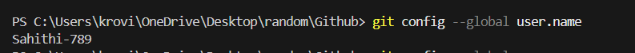

##b.
##Command Name:git config --global user.email
##Syntax : git config --global user.email "Email"
##Purpose : Sets the global email associated with commits.
###Screenshot Proof : 
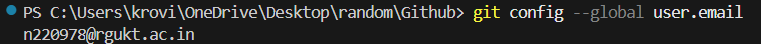

##c.
##Command Name: git config --list
##Syntax : git config --list | findstr user
##Purpose : Displays all current Git configuration settings.
###Screenshot Proof : 
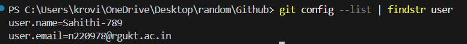

##d.
##Command Name:git config --unset
##Syntax : git config --unset <key>
##Example : git config --unset user.tempvalue

##Purpose : Removes a specific configuration setting.
###Screenshot Proof : 
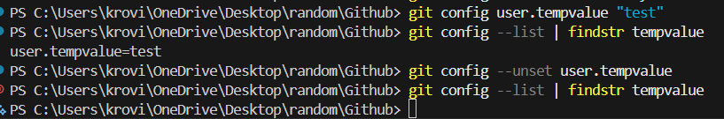

##2.Repository Setup Commands

##a.
##Command Name:git init 
##Syntax : git init
##Example: git init
##Purpose : Initializes a new Git repository 
###Screenshot Proof : 
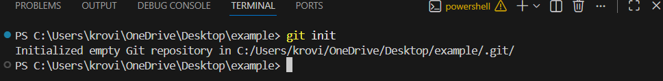

##b.
##Command Name:git clone
##Syntax : git clone "https://github//......."
##Example : git clone https://github.com/n220978/Github.git
##Purpose : Creates a local copy of a remote repository
###Screenshot Proof : 
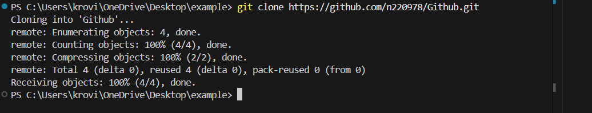

##c.
##Command Name:git clone --branch
##Syntax : git clone -b  <branch Name> "Project repository name"
##Example : git clone -b feature-login https://github.com/username/project.git
##Purpose : Clones a specific branch from a repository.
###Screenshot Proof : 
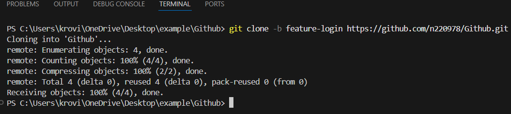

##d.
##Command Name:git clone --depth
##Syntax : git clone --depth <number> repository-url
##Purpose : Performs a shallow clone with limited commit history
##Example : git clone --depth 1 https://github.com/n220978/Github.git
###Screenshot Proof : 
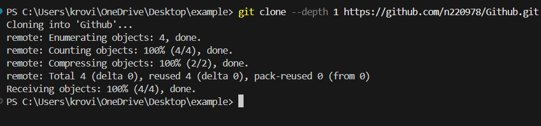

##3.Repository Status & Inspection
##a.
##Command Name: git status
##Syntax : git status
##Example : git status
##Purpose : Shows the current state of working directory and staging area.
###Screenshot Proof : 
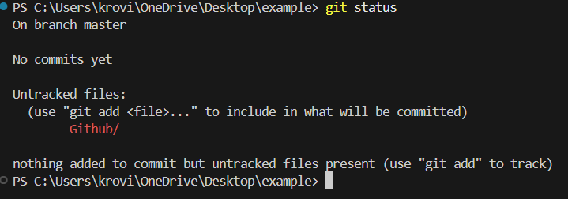

##b.
##Command Name:git log
##Syntax : git log
##Example: git log
##Purpose : Displays commit history.
###Screenshot Proof : 
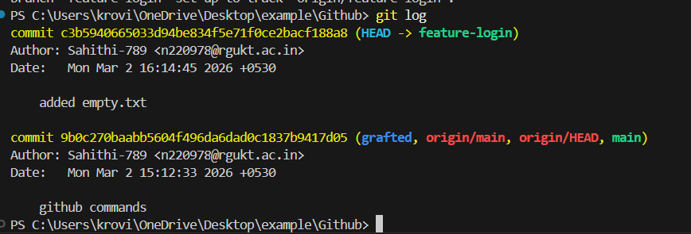

##c.
##Command Name:git log --oneline
##Syntax : git log [options]
##Example:git commit -m "added empty.txt"
            git log --oneline
##Purpose : Shows compact commit history (one line per commit).
###Screenshot Proof : 
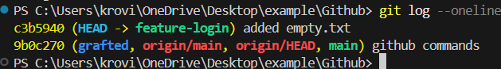

##d.
##Command Name:git log --graph
##Syntax : git log --oneline --graph (or) git log --graph
##Example: git log --oneline --graph

##Purpose :Displays commit history in graphical branch format. 
###Screenshot Proof : 
)

##e.
##Command Name:git show
##Syntax : git show (or) git show <commit-id>
##Example: git show
##Purpose : Displays detailed information about a specific commit.
###Screenshot Proof : 
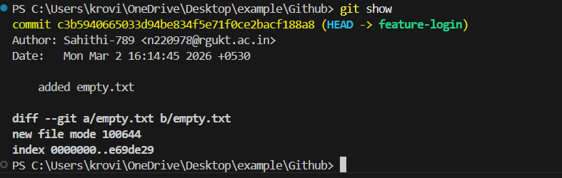

##f.
##Command Name:git diff
##Syntax : git diff
##Example : git diff
##Purpose : Shows changes between working directory and last commit.
###Screenshot Proof : 

##g.
##Command Name:git diff
##Syntax : git diff --staged
##Purpose : Shows changes between staging area and last commit.
###Screenshot Proof : 
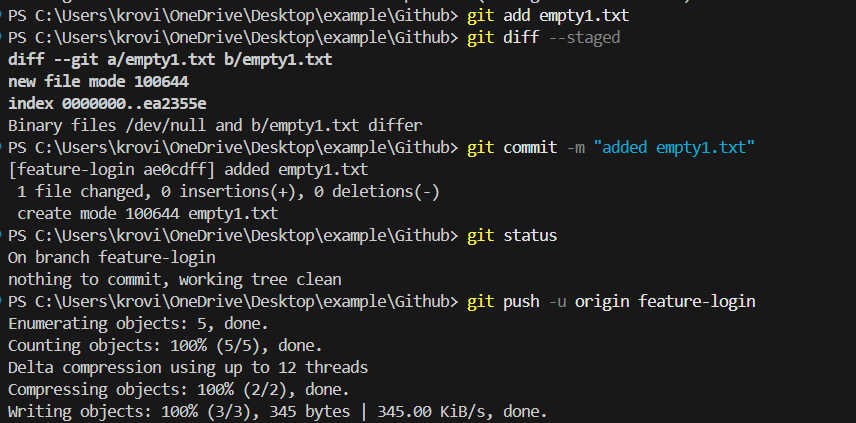

##h.
##Command Name:git blame
##Syntax : git blame filename
##Example :git blame normal.py
##Purpose : shows who last modified each line of a file.
###Screenshot Proof : 
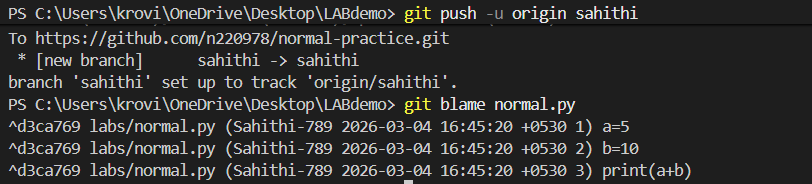

##i.
##command Name : git reflog
##Syntax : git reflog
##Example :git reflog
##Purpose:shows every movement of HEAD in your repository.
##Screenshot Proof : 
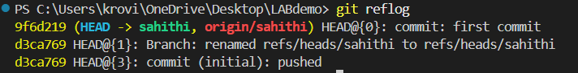

##j.
##command Name : git shortlog
##Syntax : git shortlog
##Example : git shortlog
##Purpose:Summarizes commit history grouped by author
##Screenshot Proof : 
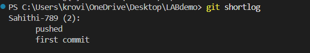

##4.File Tracking Commands
##a.
##command Name : git add  
##Syntax : git add filename
##Example :git add normal1.py
##Purpose:to add only particular files or folders that we mention
##Screenshot Proof : 
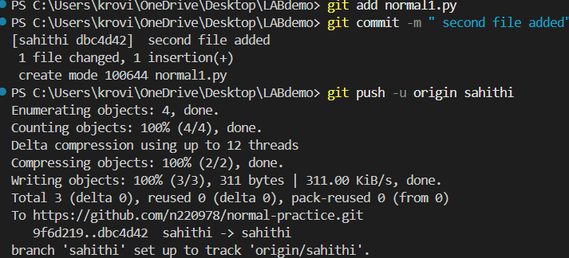

##b.
##command Name : git add .
##Syntax : git add .
##Example : git add .
##Purpose:to add all the files or folders within the particular path
##Screenshot Proof : 

##c.
##command Name : git add -p
##Syntax : git add -p
##Example :
##Purpose:Add changes patch by patch (hunk by hunk) instead of adding the whole file.
##Screenshot Proof : 
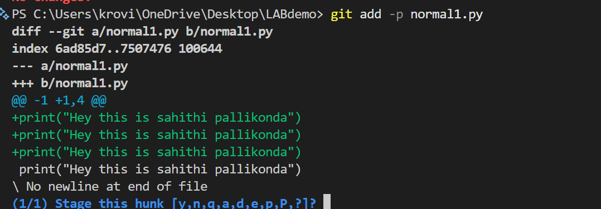

d.
Command Name : git restore
Syntax : git restore <file-name>
Example : git restore index.html
Purpose : Restores a file in the working directory to the last committed state, discarding local changes.
Screenshot Proof :
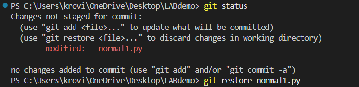

##i.
Command Name : git restore --staged
Syntax : git restore --staged <file-name>
Example : git restore --staged app.p
Purpose : Removes a file from the staging area but keeps the changes in the working directory.
Screenshot Proof :
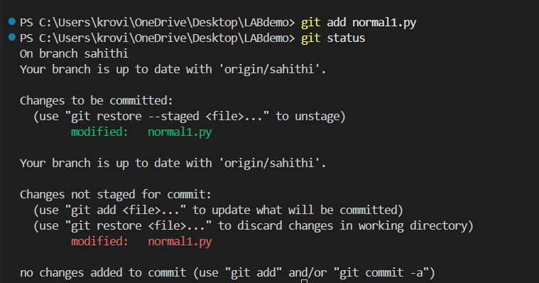

##j.
 Command Name : git rm
Syntax : git rm <file-name>
Example : git rm old_file.py
Purpose : Removes a file from both the working directory and the Git repository.
Screenshot Proof :
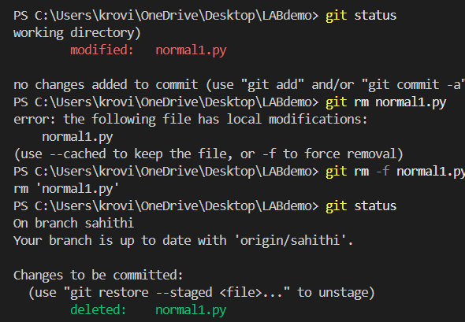

##k.
Command Name : git mv
Syntax : git mv <old-file-name> <new-file-name>
Example : git mv oldname.txt newname.txt
Purpose : Renames or moves a file and stages the change automatically.
Screenshot Proof :
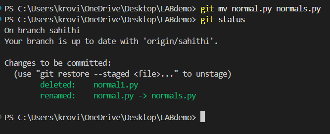

##5. Commit Commands
##a.
Command Name : git commit
Syntax : git commit
Example : git commit
Purpose : Records the staged changes into the repository by creating a new commit.
Screenshot Proof :
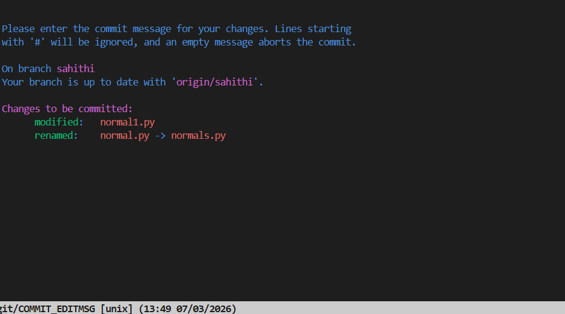

##b.
Command Name : git commit -m
Syntax : git commit -m "message"
Example : git commit -m "Added login feature"
Purpose : Creates a commit with a message describing the changes.
Screenshot Proof :
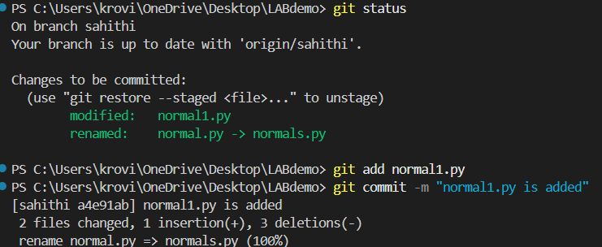

##c.
Command Name : git commit --amend
Syntax : git commit --amend
Example : git commit --amend -m "Updated commit message"
Purpose : Modifies the most recent commit (message or files).
Screenshot Proof :
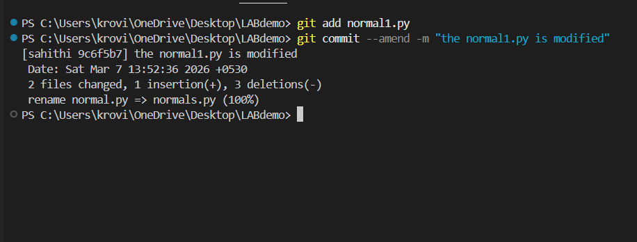

##d.
Command Name : git commit --no-edit
Syntax : git commit --amend --no-edit
Example : git commit --amend --no-edit
Purpose : Updates the last commit without changing the commit message.
Screenshot Proof :
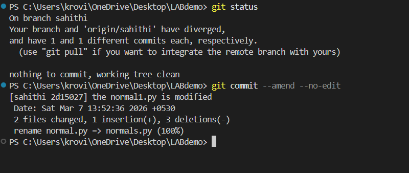

##6.Branch Management Commands

##a.
Command Name : git branch
Syntax : git branch
Example : git branch
Purpose : Lists all local branches in the repository.
Screenshot Proof :
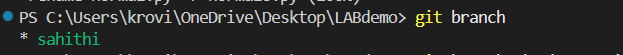

##b.
Command Name : git branch -a
Syntax : git branch -a
Example : git branch -a
Purpose : Displays all local and remote branches.
Screenshot Proof :
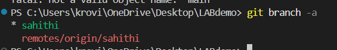

##c.
Command Name : git branch -d
Syntax : git branch -d <branch-name>
Example : git branch -d feature-login
Purpose : Deletes a branch that has already been merged.
Screenshot Proof :
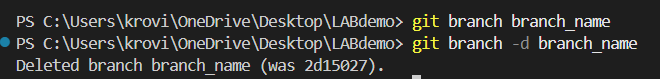

##d.
Command Name : git branch -D
Syntax : git branch -D <branch-name>
Example : git branch -D feature-login
Purpose : Force deletes a branch even if it has not been merged.
Screenshot Proof :
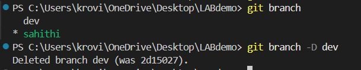

##e.
Command Name : git checkout
Syntax : git checkout <branch-name>
Example : git checkout develop
Purpose : Switches to another branch.
Screenshot Proof :
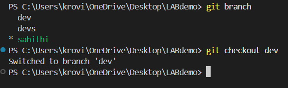

##f.
Command Name : git checkout -b
Syntax : git checkout -b <branch-name>
Example : git checkout -b feature-ui
Purpose : Creates a new branch and switches to it immediately.
Screenshot Proof :
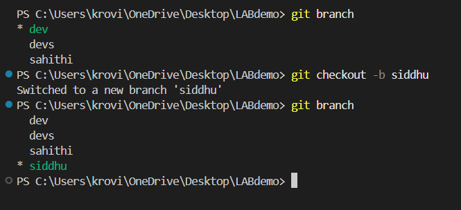

##g.
Command Name : git switch
Syntax : git switch <branch-name>
Example : git switch main
Purpose : Switches to another branch using the modern Git command.
Screenshot Proof:
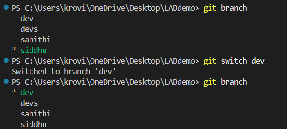

##h.
Command Name : git switch -c
Syntax : git switch -c <branch-name>
Example : git switch -c feature-auth
Purpose : Creates and switches to a new branch.
Screenshot Proof :
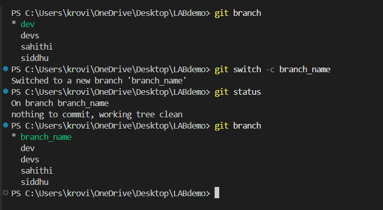

##7.Merge & Integration Commands

##a.
Command Name : git merge
Syntax : git merge <branch-name>
Example : git merge feature-login
Purpose : Combines changes from the specified branch into the current branch.
Screenshot Proof :
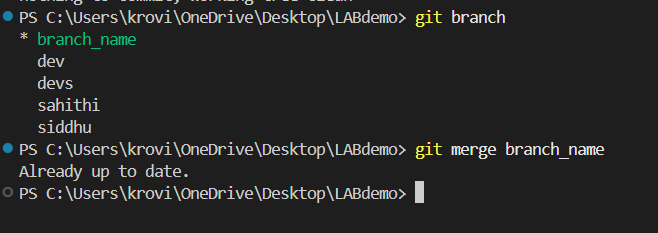

##b.
Command Name : git merge --no-ff
Syntax : git merge --no-ff <branch-name>
Example : git merge --no-ff feature-ui
Purpose : Forces Git to create a merge commit even when a fast-forward merge is possible.
Screenshot Proof :
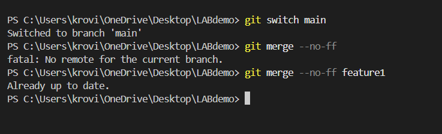
 

 ##8. Remote Repository Commands
##a.
Command Name : git remote
Syntax : git remote
Example : git remote
Purpose : Displays the list of remote repositories connected to the local repository.
Screenshot Proof :
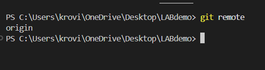

##b.
Command Name : git remote -v
Syntax : git remote -v
Example : git remote -v
Purpose : Shows remote repository URLs for fetch and push operations.
Screenshot Proof :
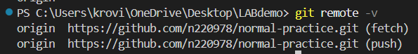

##c.
Command Name : git remote add
Syntax : git remote add <name> <repository-url>
Example : git remote add origin https://github.com/user/project.git
Purpose : Adds a new remote repository.
Screenshot Proof :
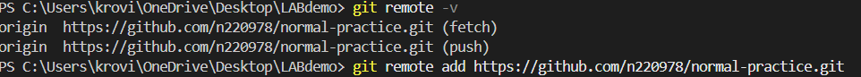

##d.
Command Name : git remote remove
Syntax : git remote remove <name>
Example : git remote remove origin
Purpose : Removes the connection to a remote repository.
Screenshot Proof :
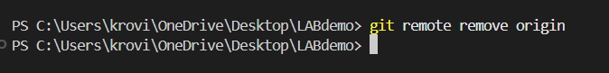

##e.
Command Name : git fetch
Syntax : git fetch
Example : git fetch origin
Purpose : Downloads changes from the remote repository without merging them.
Screenshot Proof :

f.
Command Name : git fetch --all
Syntax : git fetch --all
Example : git fetch --all
Purpose : Fetches updates from all configured remote repositories.
Screenshot Proof :

g.
Command Name : git pull
Syntax : git pull
Example : git pull origin main
Purpose : Fetches changes from the remote repository and merges them into the current branch.
Screenshot Proof :

h.
Command Name : git pull --rebase
Syntax : git pull --rebase
Example : git pull --rebase origin main
Purpose : Fetches changes and rebases the current branch instead of merging.
Screenshot Proof :

i.
Command Name : git push
Syntax : git push
Example : git push origin main
Purpose : Uploads local commits to the remote repository.
Screenshot Proof :

j.
Command Name : git push -u origin branch-name
Syntax : git push -u origin <branch-name>
Example : git push -u origin feature-login
Purpose : Pushes a branch and sets the upstream tracking branch.
Screenshot Proof :

k.
Command Name : git push --force
Syntax : git push --force
Example : git push --force origin main
Purpose : Forces a push to overwrite the remote branch history.
Screenshot Proof :

9. Stash Commands
Command Name : git stash

Syntax : git stash
Example : git stash
Purpose : Temporarily saves the changes in the working directory without committing them so that you can work on something else.
Screenshot Proof :
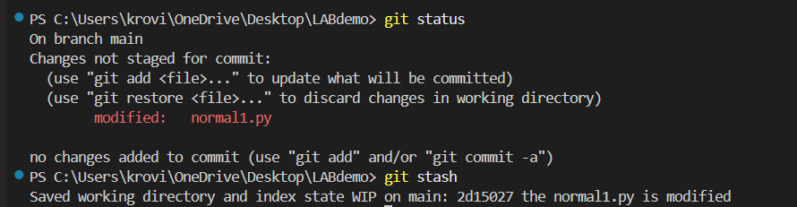

Command Name : git stash list

Syntax : git stash list
Example : git stash list
Purpose : Displays the list of all stashed changes saved in the repository.
Screenshot Proof :
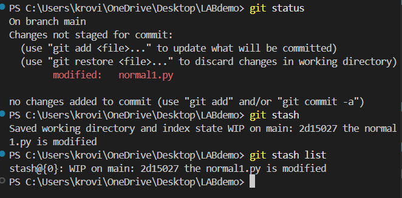

Command Name : git stash pop

Syntax : git stash pop
Example : git stash pop
Purpose : Applies the most recent stash and removes it from the stash list.
Screenshot Proof :
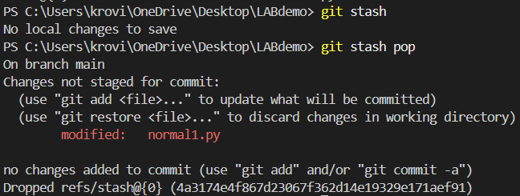

Command Name : git stash apply

Syntax : git stash apply
Example : git stash apply stash@{0}
Purpose : Applies a specific stash without removing it from the stash list.
Screenshot Proof :
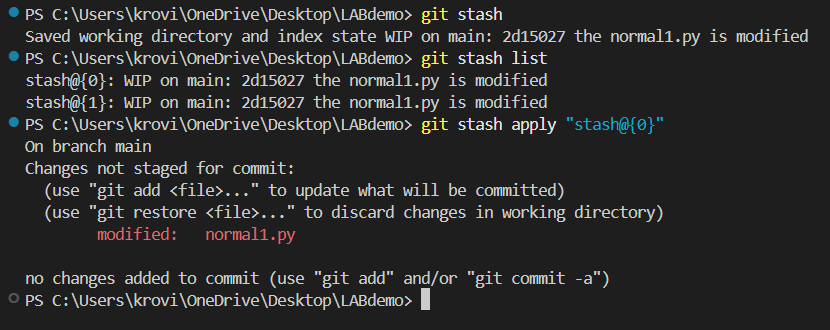

Command Name : git stash drop

Syntax : git stash drop
Example : git stash drop stash@{0}
Purpose : Deletes a specific stash from the stash list.
Screenshot Proof :
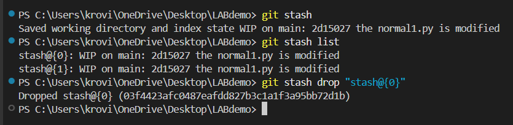

Command Name : git stash clear

Syntax : git stash clear
Example : git stash clear
Purpose : Removes all stashed changes permanently.
Screenshot Proof :
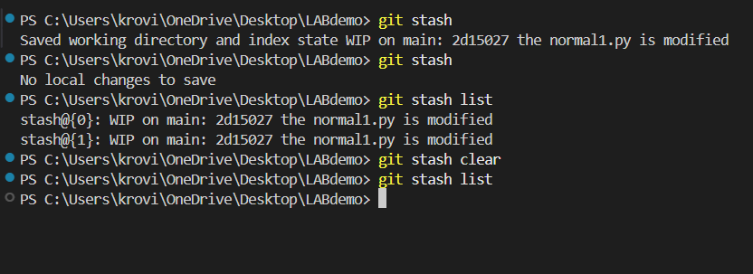

10. Reset & Undo Commands
Command Name : git reset

Syntax : git reset <commit>
Example : git reset HEAD~1
Purpose : Resets the current HEAD to the specified commit.
Screenshot Proof :
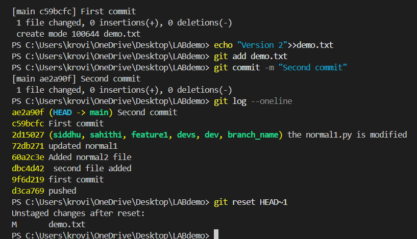

Command Name : git reset --soft

Syntax : git reset --soft <commit>
Example : git reset --soft HEAD~1
Purpose : Moves the HEAD pointer but keeps changes staged.
Screenshot Proof :
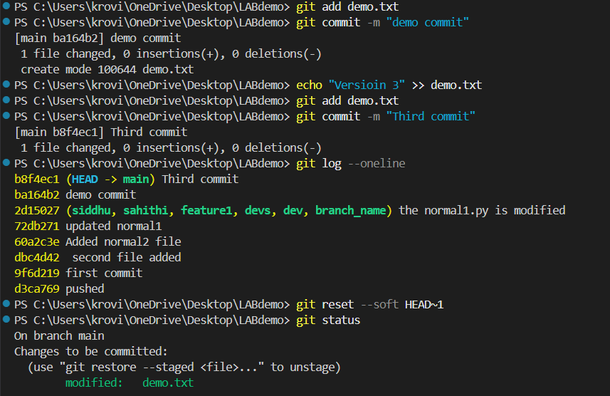

Command Name : git reset --mixed

Syntax : git reset --mixed <commit>
Example : git reset --mixed HEAD~1
Purpose : Resets the HEAD and unstages changes but keeps them in the working directory.
Screenshot Proof :
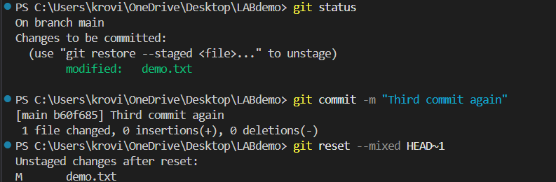

Command Name : git reset --hard

Syntax : git reset --hard <commit>
Example : git reset --hard HEAD~1
Purpose : Completely removes commits and changes from the working directory.
Screenshot Proof :
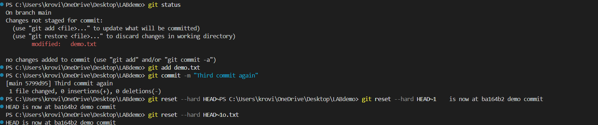

Command Name : git revert

Syntax : git revert <commit>
Example : git revert HEAD
Purpose : Creates a new commit that reverses the changes made by a previous commit.
Screenshot Proof :

Command Name : git clean -f

Syntax : git clean -f
Example : git clean -f
Purpose : Removes untracked files from the working directory.
Screenshot Proof :

Command Name : git clean -fd

Syntax : git clean -fd
Example : git clean -fd
Purpose : Removes untracked files and directories from the working directory.
Screenshot Proof :

11. Rebasing Commands
Command Name : git rebase

Syntax : git rebase <branch>
Example : git rebase main
Purpose : Reapplies commits from the current branch on top of another branch.
Screenshot Proof :

Command Name : git rebase -i

Syntax : git rebase -i <commit>
Example : git rebase -i HEAD~3
Purpose : Performs an interactive rebase to edit, reorder, squash, or remove commits.
Screenshot Proof :

Command Name : git rebase --continue

Syntax : git rebase --continue
Example : git rebase --continue
Purpose : Continues the rebase process after resolving conflicts.
Screenshot Proof :

Command Name : git rebase --abort

Syntax : git rebase --abort
Example : git rebase --abort
Purpose : Cancels the rebase operation and returns the repository to its previous state.
Screenshot Proof :

12. Cherry Pick & Patch Commands
Command Name : git cherry-pick

Syntax : git cherry-pick <commit>
Example : git cherry-pick a1b2c3d
Purpose : Applies a specific commit from one branch to another.
Screenshot Proof :

Command Name : git format-patch

Syntax : git format-patch <commit>
Example : git format-patch HEAD~2
Purpose : Creates patch files for commits that can be shared or applied later.
Screenshot Proof :

Command Name : git apply

Syntax : git apply <patch-file>
Example : git apply change.patch
Purpose : Applies changes from a patch file to the working directory.
Screenshot Proof :

Command Name : git am

Syntax : git am <patch-file>
Example : git am 0001-change.patch
Purpose : Applies patches and records them as commits.
Screenshot Proof :

13. Tagging Commands
Command Name : git tag

Syntax : git tag <tagname>
Example : git tag v1.0
Purpose : Creates a tag for a specific commit.
Screenshot Proof :

Command Name : git tag -a

Syntax : git tag -a <tagname> -m "message"
Example : git tag -a v1.0 -m "First Release"
Purpose : Creates an annotated tag with a message.
Screenshot Proof :

Command Name : git tag -d

Syntax : git tag -d <tagname>
Example : git tag -d v1.0
Purpose : Deletes a tag from the local repository.
Screenshot Proof :

Command Name : git push origin --tags

Syntax : git push origin --tags
Example : git push origin --tags
Purpose : Pushes all local tags to the remote repository.
Screenshot Proof :

14. Submodule Commands
Command Name : git submodule add

Syntax : git submodule add <repository-url>
Example : git submodule add https://github.com/user/project.git
Purpose : Adds another repository as a submodule inside the current repository.
Screenshot Proof :

Command Name : git submodule init

Syntax : git submodule init
Example : git submodule init
Purpose : Initializes local configuration for submodules.
Screenshot Proof :

Command Name : git submodule update

Syntax : git submodule update
Example : git submodule update
Purpose : Fetches and checks out the submodule content.
Screenshot Proof :

15. Debugging Commands
Command Name : git bisect

Syntax : git bisect
Example : git bisect start
Purpose : Helps find the commit that introduced a bug using binary search.
Screenshot Proof :

Command Name : git bisect start

Syntax : git bisect start
Example : git bisect start
Purpose : Starts the bisect process to locate a faulty commit.
Screenshot Proof :

Command Name : git bisect good

Syntax : git bisect good <commit>
Example : git bisect good HEAD~5
Purpose : Marks a commit as good during bisect search.
Screenshot Proof :

Command Name : git bisect bad

Syntax : git bisect bad <commit>
Example : git bisect bad HEAD
Purpose : Marks a commit as bad during bisect search.
Screenshot Proof :

